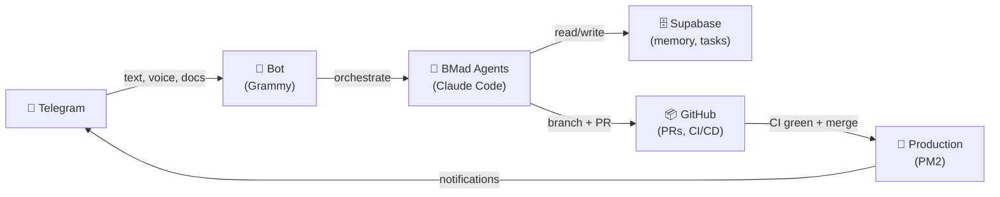
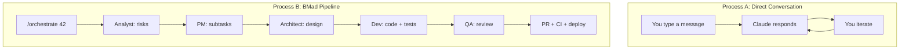
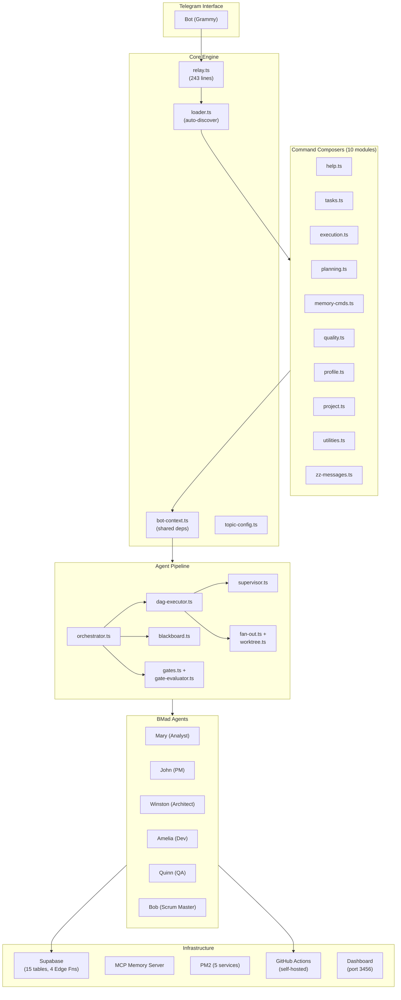
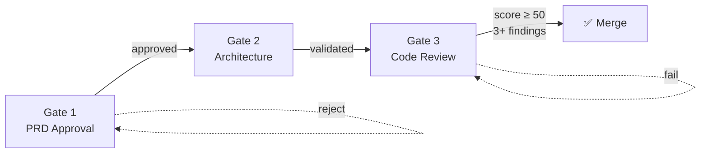
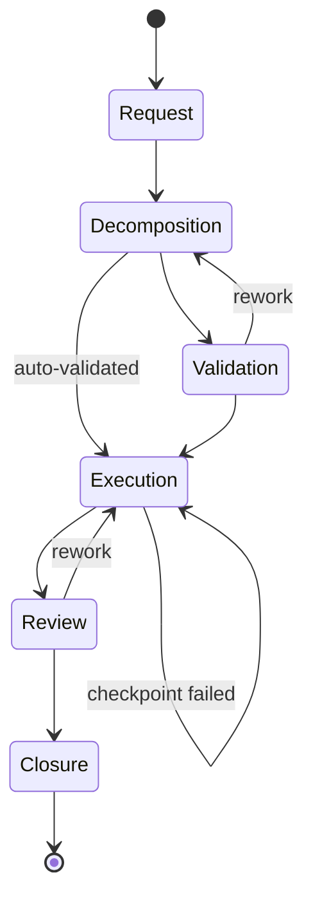
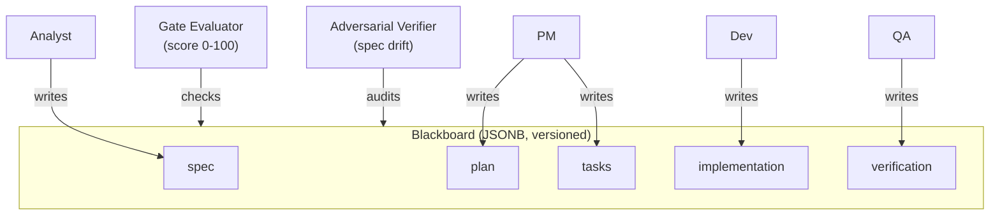
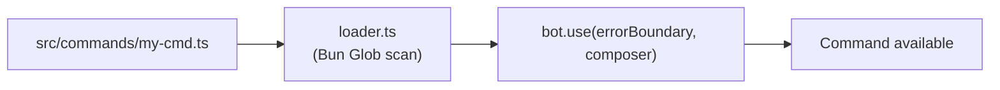
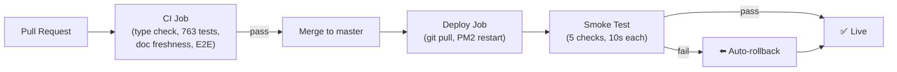

# Claude Telegram Relay

A self-improving agentic framework powered by Claude Code, piloted via Telegram.

Not just a chatbot — a structured AI workflow system with 6 specialized agents, quality gates, parallel execution, intelligent memory, and continuous improvement through retrospectives.

> **Originally based on [Goda Go](https://youtube.com/@GodaGo)**'s relay template | [AI Productivity Hub Community](https://skool.com/autonomee)

## How It Works

You talk to a Telegram bot. Behind the scenes, 6 AI agents collaborate through a structured pipeline to analyze, plan, code, test, and deploy — all orchestrated by the BMad methodology.



## Process A vs Process B

Two ways to work with the bot — choose based on task complexity.



| | Process A (conversation) | Process B (pipeline) |
|---|---|---|
| **Best for** | Quick questions, brainstorming, small fixes | Features, sprints, multi-file changes |
| **Quality gates** | None | 3 gates (PRD, architecture, code review) |
| **Agents involved** | 1 (Claude) | Up to 6 specialized agents |
| **Output** | Text reply | Branch, PR, CI, deploy |
| **Cost** | Low (single call) | Higher (multi-agent, structured) |
| **Traceability** | Chat history | Blackboard, metrics, retros |

Process A is the default for free-form messages. Process B activates via `/exec`, `/orchestrate`, or `/autopipeline`.

## Architecture

Modular TypeScript monolith: 54 source modules, 16,700 lines of code, 763 tests.



### Data Flow

```mermaid
sequenceDiagram
    participant U as User (Telegram)
    participant B as Bot
    participant S as Supabase
    participant O as Orchestrator
    participant A as Agents (Claude Code)
    participant G as GitHub

    U->>B: /orchestrate 42
    B->>S: Load task, memory, PRD
    B->>O: Start pipeline (DEFAULT)

    rect rgb(40, 40, 60)
        Note over O,A: Pipeline Execution
        O->>A: Analyst → feasibility + risks
        O->>A: PM → subtasks + priorities
        O->>A: Architect → design + decisions
        O->>A: Dev → code + tests (in worktree)
        O->>A: QA → review + score
    end

    A->>G: Branch + PR
    G->>G: CI checks (self-hosted runner)
    G-->>U: PR notification
    U->>G: Merge
    G->>B: Deploy (git pull + PM2 restart)
    B-->>U: Deploy notification
```



## BMad Methodology

### 6 Specialized Agents

Each agent has a distinct persona, YAML-defined capabilities, and dedicated Claude Code CLI flags (model, effort, budget).

| Agent | Persona | Role | Model |
|-------|---------|------|-------|
| Mary | Analyst | Market research, feasibility, domain expertise | Sonnet |
| John | PM | PRD creation, task decomposition, priorities | Sonnet |
| Winston | Architect | Technical design, architecture decisions | Opus |
| Amelia | Dev | Code execution, test-driven implementation | Opus |
| Quinn | QA | Test automation, code review, scoring | Sonnet |
| Bob | Scrum Master | Sprint planning, retrospectives, metrics | Haiku |

### 3 Quality Gates



- **Gate 1** — No execution without an approved PRD
- **Gate 2** — Tasks must have sufficient technical context
- **Gate 3** — Adversarial code review (minimum 3 findings, score 0-100, blocks merge if < 50)
- Gates can be bypassed with explicit user override via inline Telegram buttons

### Pipelines

| Pipeline | Agents | Auto-selected when |
|----------|--------|--------------------|
| DEFAULT | analyst → pm → architect → dev → qa | Standard features |
| QUICK | dev → qa | Bugs, fixes, docs, simple P3 tasks |
| REVIEW | qa → architect | Review, audit, refactor tasks |

Dynamic pipeline selection based on task title, description keywords, and priority. Manual override available.

### Workflow



Defined in `config/workflow.yaml`. Each step has configurable checkpoints (off / light / strict) with retry policies.

## Key Features

### Parallel Execution

DAG-based parallel scheduling for multi-agent pipelines:

- Independent agents run concurrently (e.g., analyst + PM in parallel)
- Fan-out N Dev agents on subtasks, each in an isolated git worktree
- Deterministic TypeScript supervisor: retry / skip / escalate (zero LLM cost)
- Semaphore-gated concurrency (default max 3)
- Activate with `--parallel` flag

### Blackboard Architecture

Shared structured workspace for multi-agent collaboration:



- Optimistic locking with concurrent write retry
- Role-based write authorization (agents only write their sections)
- Gate Evaluator: LLM-based quality checks with evaluate-rework loop (max 2 iterations)
- Adversarial Verifier: clean room spec-vs-implementation drift detection
- Traceability report: FR → tasks → tests → files
- Activate with `--blackboard` flag

### Intelligent Memory

- Importance scoring with temporal decay (half-life 70 days)
- Auto-classification via GPT-4o-mini (facts, goals, ideas)
- Semantic deduplication and contradiction detection
- Ideas pipeline: capture → review → promote to task or archive
- MCP server for Claude Code sessions (search, list, capture)

### Smart Notifications

- All notifications route through a batching queue
- Flush after 5min interval or 5-message threshold
- Quiet hours (default 20h-9h, timezone-aware) queue for morning digest
- Critical alerts bypass quiet hours
- Inline action buttons: start/complete tasks, promote ideas, view PRs
- Per-type preferences via `/notify`

### Continuous Improvement

- Sprint metrics: velocity, completion rate, rework rate, cycle time
- Multi-sprint pattern analysis across projects
- Retrospective actions automatically propose workflow changes
- Feedback loop: recurring retro patterns become permanent agent instructions
- Cross-project improvement propagation via voting
- Dynamic user profiling: learns communication style and autonomy level

### Cost Tracking

- Per-agent and per-task token usage tracking
- Multi-model pricing (Opus $15/$75, Sonnet $3/$15, Haiku $0.80/$4 per 1M tokens)
- Sprint cost aggregation
- Pre-implementation cost estimation via `/estimate`

### Multi-Project Management

- Topic-based routing: each Telegram forum topic maps to a project
- All commands auto-scope to the active project
- Separate workflows, metrics, and retrospectives per project
- Cross-project improvement propagation

### Document Sharding

Large documents (PRDs, architecture specs) are split into indexed sections. Only relevant sections are loaded into agent context, saving tokens significantly.

## Extending the Bot

Adding a new command requires a single file in `src/commands/`. The loader auto-discovers it.



**3 steps to add a command:**

```typescript
// src/commands/my-cmd.ts
import { Composer, Context } from "grammy";
import type { BotContext } from "../bot-context.ts";

export default function myCommands(bctx: BotContext): Composer<Context> {
  const composer = new Composer<Context>();
  const { sendResponse, supabase } = bctx;

  composer.command("mycommand", async (ctx) => {
    await sendResponse(ctx, "It works!");
  });

  return composer;
}
```

1. Create `src/commands/my-cmd.ts` exporting a factory `(BotContext) => Composer`
2. Register commands inside the Composer using `composer.command()` or `composer.on()`
3. Restart the bot — the loader picks it up automatically

No changes to `relay.ts` needed. See [ADR-007](docs/adr/007-composer-extensibility.md) for design rationale.

## Telegram Commands

### Workflow

| Command | Description |
|---------|-------------|
| `/prd <description>` | Create, list, view, approve, or reject a PRD |
| `/plan <description>` | Decompose request into subtasks |
| `/planify` | Proactive backlog analysis and priority reordering |
| `/exec <id>` | Launch Claude Code agent (requires Gate 1 approval) |
| `/orchestrate <id>` | Full multi-agent pipeline (`--blackboard`, `--parallel`) |
| `/autopipeline <id>` | Autonomous end-to-end pipeline |
| `/workflow` | View BMad process overview |
| `/agents` | List all agents and capabilities |

### Tasks & Sprint

| Command | Description |
|---------|-------------|
| `/task <title>` | Create task (`--desc`, `--priority`, `--hours`) |
| `/backlog` | View backlog |
| `/sprint` | Sprint status with progress bar |
| `/start <id>` | Mark task in progress |
| `/done <id>` | Complete a task |

### Quality & Metrics

| Command | Description |
|---------|-------------|
| `/metrics [sprint]` | Sprint metrics (velocity, rework, cycle time) |
| `/retro <sprint>` | Generate retrospective |
| `/patterns` | Multi-sprint pattern analysis |
| `/alerts` | Check anomalies (stuck tasks, rework spikes) |
| `/cost` | Token usage and cost breakdown |
| `/estimate` | Pre-implementation cost estimation |
| `/monitor` | Production monitoring (response time, spawn stats) |

### Intelligence

| Command | Description |
|---------|-------------|
| `/brain` | Memory synthesis: patterns, health, ideas, suggestions |
| `/ideas` | Ideas pipeline: list, add, review, promote, archive |
| `/remind <msg>` | Set a reminder |
| `/profile` | User profile and insights |
| `/notify` | Notification preferences (quiet hours, per-type toggle) |

### Projects

| Command | Description |
|---------|-------------|
| `/projects` | List all projects |
| `/project` | Create, switch, archive, or link topic to a project |

### Utilities

| Command | Description |
|---------|-------------|
| `/help` | Command reference |
| `/status` | System health (CPU, RAM, PM2, messages) |
| `/speak <text>` | Text-to-speech |
| `/export` | Export all data as JSON |
| `/feature` | Feature flags (list, enable, disable) |
| `/rollback` | Rollback to previous commit |

## Infrastructure

### PM2 Services

| Service | Schedule | Purpose |
|---------|----------|---------|
| `claude-relay` | Always on | Main Telegram bot |
| `claude-dashboard` | Always on | Kanban board (port 3456) |
| `claude-alert-cron` | Hourly | Anomaly detection + morning digest |
| `claude-autonomy-cron` | Daily 8h | Autonomous task creation from codebase scan |
| `claude-system-alerts` | Every 15min | System health monitoring |

### CI/CD

Self-hosted GitHub Actions runner on the production server.



- Feature branch workflow enforced: branch → PR → CI → merge
- `/exec` creates branches and PRs automatically
- Adversarial code review at Gate 3
- Deploy notification sent to Telegram
- Conventional commit format enforced by pre-push hook

### Dashboard

Kanban board at port 3456 with:
- Project filter
- Sprint progress visualization
- Task cards with status
- API: `/api/projects`, `/api/tasks`, `/api/prds`, `/api/health`

## Database

15 tables in Supabase with pgvector for semantic search.

| Table | Purpose |
|-------|---------|
| `messages` | Conversation history with embeddings |
| `memory` / `memory_archive` | Facts, goals, ideas with importance scoring |
| `tasks` | Backlog with BMad story fields (AC, subtasks, dev notes) |
| `prds` | Product Requirements Documents lifecycle |
| `projects` | Multi-project registry with topic mapping |
| `sprint_metrics` | Quantitative sprint data |
| `retros` | Retrospective analyses and accepted actions |
| `workflow_logs` | Transition tracking |
| `feedback_rules` | Learned patterns from retros |
| `workflow_proposals` | Cross-project improvement proposals |
| `document_shards` | Indexed document sections |
| `cost_tracking` | Token usage and cost per agent |
| `blackboard` | Shared JSONB workspace for pipelines |
| `logs` | System logs |

### Edge Functions

| Function | Purpose |
|----------|---------|
| `embed` | Auto-generates embeddings on INSERT (via DB webhooks) |
| `search` | Semantic search endpoint |
| `classify-thought` | GPT-4o-mini message classification with idea detection |
| `memory-mcp` | Memory CRUD + semantic search API for MCP server |

## Project Structure

```
src/                        54 TypeScript modules
  relay.ts                  Bot entrypoint (243 lines)
  bot-context.ts            Shared dependencies for Composers
  loader.ts                 Auto-discovers Composer modules
  topic-config.ts           Per-topic system prompts
  commands/                 10 Composer modules (33 commands + 4 handlers)
  orchestrator.ts           Multi-agent pipeline engine
  blackboard.ts             Shared workspace (JSONB, versioned)
  dag-executor.ts           Parallel agent scheduler
  supervisor.ts             Deterministic retry/skip/escalate
  fan-out.ts + worktree.ts  Parallel dev agents in git worktrees
  memory.ts                 Facts, goals, ideas, semantic search
  gates.ts                  3-gate quality enforcement
  gate-evaluator.ts         LLM-based gate scoring
  adversarial-verifier.ts   Spec drift detection
  bmad-agents.ts            6 agent definitions (YAML templates)
  agent.ts                  Claude Code CLI integration
  cost-tracking.ts          Multi-model token accounting
  workflow.ts               Configurable state machine
  notifications.ts          Proactive notification routing
  notification-queue.ts     Batching, quiet hours, digests
  ...                       (20+ more modules)

config/
  workflow.yaml             Workflow state machine
  profile.md                User personalization
  features.json             Feature flags
  bmad-templates/           Agent YAML definitions + workflows

dashboard/                  Kanban board (server.ts + index.html)
db/schema.sql               Authoritative database schema
mcp/memory-server.ts        MCP memory server for Claude Code
supabase/functions/         4 Edge Functions
tests/                      763 tests (unit + integration + E2E)
scripts/                    Deploy, setup, CI utilities
docs/adr/                   7 Architecture Decision Records
```

## Resilience

- Rate limiting (30 msg/min)
- Circuit breaker (3 consecutive errors = skip)
- Lock file prevents duplicate instances
- Graceful shutdown with Supabase session cleanup
- PM2 auto-restart (max 10 with 5s delay)
- Heartbeat during long agent operations
- Auto-rollback on failed deploys
- Feature flags for safe rollout

## Quick Start

**Prerequisites:** [Bun](https://bun.sh), [Claude Code](https://claude.ai/claude-code) CLI, a Telegram account.

```bash
git clone https://github.com/EdouardZemb/claude-telegram-relay.git
cd claude-telegram-relay
claude
```

Claude Code reads `CLAUDE.md` and walks you through 5 setup phases: Telegram bot, Supabase database, personalization, testing, and PM2 services.

<details>
<summary>Manual setup (without Claude Code)</summary>

```bash
bun run setup          # Install deps, create .env template
# Edit .env with your API keys
bun run test:telegram  # Verify bot token
bun run test:supabase  # Verify database
bun run start          # Start the bot
```

</details>

```bash
bun test               # All 763 tests
bun run smoke          # Production smoke tests
```

## License

MIT

---

Originally based on the relay template by [Goda Go](https://youtube.com/@GodaGo).
